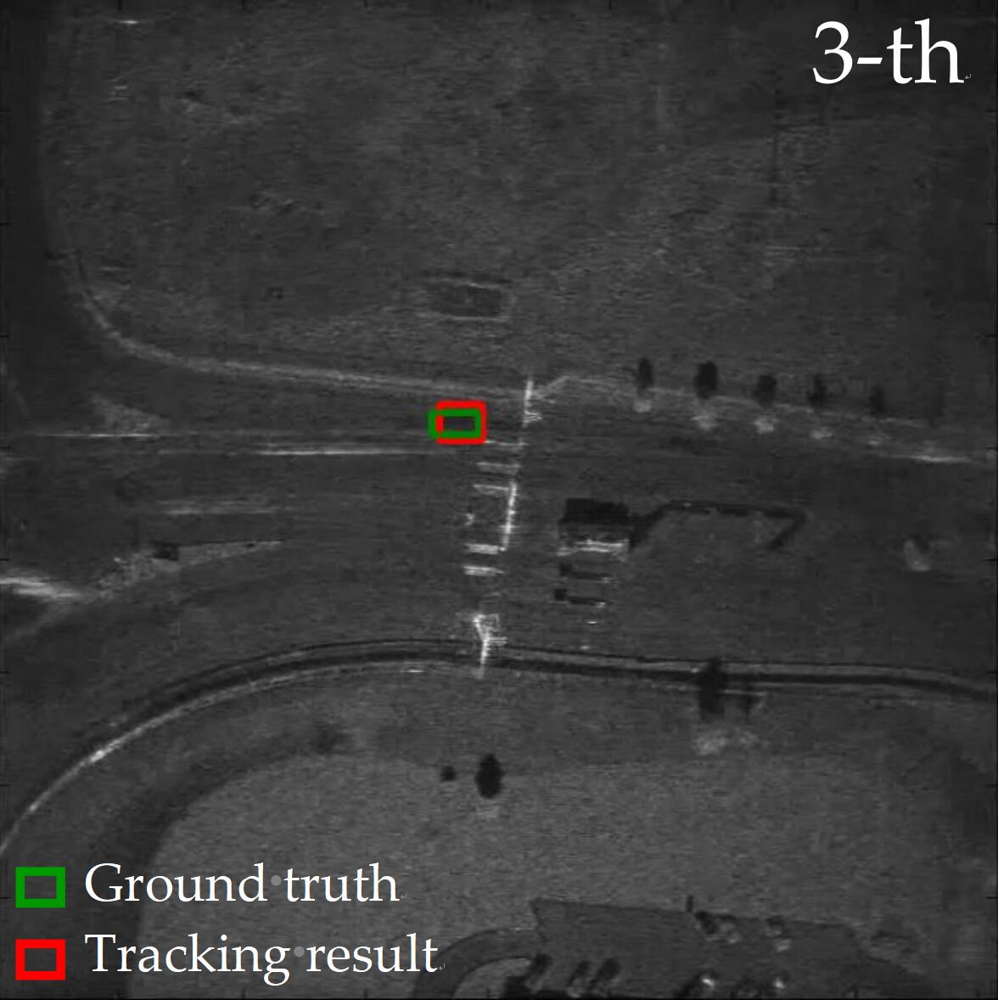
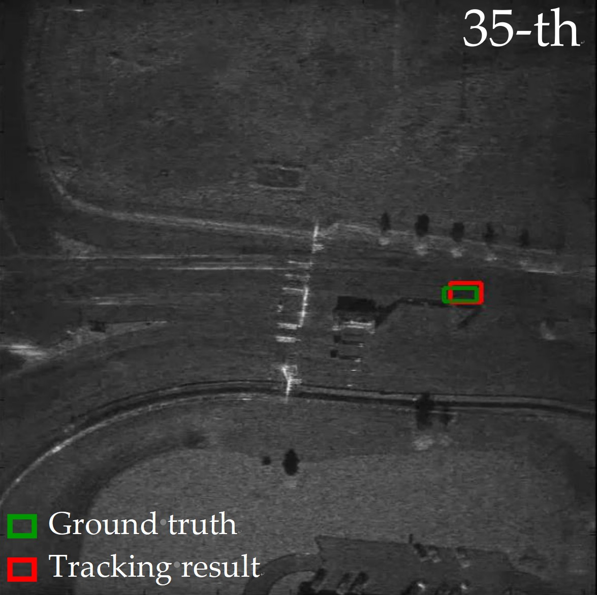
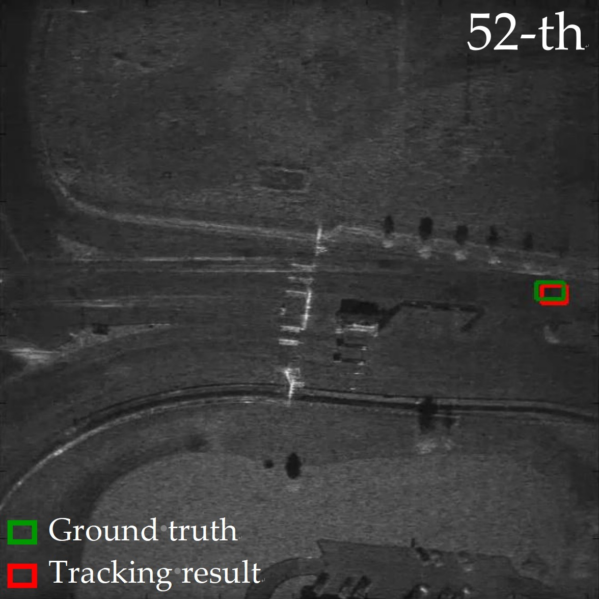

# A Novel Guided Anchor Siamese Network for Arbitrary Target-Of-Interest Tracking in Video-SAR

Jinyu Bao, Xiaoling Zhang*, Tianwen Zhang, Jun Shi, Shunjun Wei and Durga Kumar

 

Video synthetic aperture radar (Video-SAR) has the advantage of continuous and intuitive observation, which is widely used for radar moving target tracking. The shadow of a moving target has the characteristics of stable scattering and no location shift. This makes moving target tracking using shadow become a hot topic. However, existing techniques mainly rely on learning the appearance of targets. It is both impractical and uneconomical for these techniques when tracking the arbitrary Target-Of-Interest (TOI) due to targets’ diversity and arbitrariness. Therefore, to solve the problem, we propose a novel guided anchor siamese network (GASN) dedicated to the arbitrary TOI tracking in Video-SAR. GASN is based on the idea of similarity learning, which uses the feature map of the template as the convolution kernel to slide windows on the feature map of the search image, then the output indicates the similarity of the two feature maps. Based on the maximum similarity, GASN can determine the tracking result in the search image. Similarity learning abandons the appearance learning among all separate frames but learns the similarity between two images, which is independent of the training data and suitable for the arbitrary TOI tracking. Besides, a guided anchor subnetwork (GA-SubNet) is also established, which uses the prior information of the template to generate the sparse anchors, which is more closely match the shape of TOI. This can reduce the number of useless anchors so as to suppress false alarms. Our method is evaluated on the simulated and real Video-SAR data. The experiment results demonstrate that GASN is superior to two types of traditional tracking methods (Mosse and KCF) and two types of modern deep learning ones (Siamese-FC and Siamese-RPN).Finally, we conduct the ablation experiment to confirm the effectiveness of GA-SubNet.

|  |  |  |
| :--------------: | :--------------: | :--------------: |
|       (a)        |       (b)        |       (c)        |

**Figure** **1**. Tracking results of real Video-SAR data. (**a**) 3-th frame in Video 2; (**b**) 35-th frame in Video 2; (**c**) 52-th frame in Video 2.